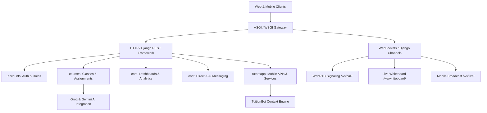

# Tuition4All - Senior Developer Codebase & Architecture Guide

Welcome to the **Tuition4All** project codebase. This document is designed to give senior engineers, architects, and code reviewers a high-level overview and deep-dive reference for all apps, data models, real-time protocols, APIs, and business workflows.

---

## 🏛️ 1. High-Level Architecture Overview

Tuition4All is a multi-role educational platform (Admin, Teacher/Tutor, Student, Parent) built with **Django 5.2**, **Django Channels (ASGI)**, **Django REST Framework (DRF)**, **Daphne**, and **SQLite/PostgreSQL**.



---

## 📂 2. Application Modules & Responsibilities

| App Name | Primary Purpose & Features |
|---|---|
| **`tution4all`** | **Project Root Configuration**: `settings.py` (Installed apps, JWT, ASGI/Channels config), `urls.py` (Top-level URL dispatcher), `asgi.py` (WebSocket routing). |
| **`accounts`** | **User Management & Authentication**: Custom `User` model with 4 distinct roles (`admin`, `teacher`, `student`, `parent`), profile extensions (`TeacherProfile`, `StudentProfile`, `ParentProfile`), parent-student linking requests, JWT auth (`api_views.py`), and registration workflows. |
| **`courses`** | **Academic Catalog & Live Classroom**: `Course`, `Category`, `LiveClass` (WebRTC room generation, Excalidraw whiteboard keys, AI session summaries), `LiveClassBooking`, `Attendance`, `Assignment`, `Project`, and `StudentSubmission`. |
| **`core`** | **Dashboards, Nav & Analytics**: Central `/dashboard/` view routing each role to their tailored control center, student attendance percentage calculation, missed session analytics, teacher certificate verification actions, and complaint handling (`IssueReport`). |
| **`chat`** | **Direct Messaging & AI Chat**: 1-to-1 persistent chat rooms between students/parents and tutors (`ChatRoom`, `Message`), turn-by-turn AI chat assistants (`AIChatSession`, `AIChatMessage`). |
| **`tutorsapp`** | **Mobile Backend & TuitionBot AI Service**: Full REST API endpoints for React Native/mobile app, tutor verification pipeline, WebSocket broadcast signaling (`consumers.py`), and `TuitionBot` context injection engine (`ai_service.py`). |
| **`assessments`, `interactions`, `finances`** | Modular placeholder apps configured for enterprise grading, billing, and interaction tracking. |

---

## 👥 3. User Roles & Access Matrix

The system enforces strict role-based access control (RBAC):

1. **👑 Admin (`role == 'admin'`)**:
   - Approves/rejects new teacher applications, verification documents, and intro videos.
   - Vets, prices, and approves newly created courses.
   - Manages platform categories, freezes/unfreezes accounts and courses.
   - Accesses `/admin/` and `/dashboard/` admin control center.

2. **🎓 Teacher / Tutor (`role == 'teacher'`)**:
   - Creates and manages courses, hourly rates, and durations.
   - Schedules private (1-to-1) and public (group) live classes.
   - Shares screen, draws on collaborative whiteboard, and conducts WebRTC video sessions.
   - Issues assignments and projects, grades submissions (`accepted`, `rejected`, `resubmit`).

3. **🎒 Student (`role == 'student'`)**:
   - Assigned unique identifier `STU-XXXXXX` on signup.
   - Enrolls in courses, selects recurring weekly slots, books live classes.
   - Joins live sessions, accesses class recordings and auto-generated AI summaries.
   - Submits homework assignments and reviews tutor ratings.

4. **👨‍👩‍👧 Parent (`role == 'parent'`)**:
   - Links student accounts using student ID with student confirmation.
   - Supervised dashboard with real-time attendance percentage, lost time calculation, and submission audit.

---

## ⚡ 4. Real-Time WebSocket Protocols (ASGI)

WebSocket connections are handled by **Daphne** and **Django Channels**:

- **WebRTC Video Signaling** (`ws/call/<room_id>/`):
  - Handled by `courses.consumers.VideoCallConsumer`.
  - Relays SDP offers, SDP answers, and ICE candidates between peers without server-side media decoding.
- **Live Whiteboard Synchronization** (`ws/whiteboard/<room_id>/`):
  - Handled by `courses.consumers.WhiteboardConsumer`.
  - Broadcasts stroke paths, erase operations, and shape metadata to all active students in the room.
- **Mobile Live Broadcast** (`ws/live/<room_id>/`):
  - Handled by `tutorsapp.consumers.LiveClassConsumer`.
  - Relays broadcast signals, participant counts, and live stream control events to mobile clients.

---

## 🤖 5. Artificial Intelligence Engine

Tuition4All incorporates dual-engine AI integration with sub-second failover:

1. **Live Class Summary Generator** (`courses/ai_utils.py`):
   - Extracts notes, handouts, and live transcripts.
   - Language Detection: Automatically outputs summaries in **Malayalam**, **Hindi**, or **English**.
   - Primary: **Groq Cloud (Llama-3.3-70b-versatile)** for sub-second responses.
   - Fallback: **Google Gemini 1.5 Flash** for deep reasoning.

2. **TuitionBot Context Engine** (`tutorsapp/ai_service.py`):
   - Injects real-time database context (attendance records, due dates, enrolled courses) directly into the system prompt.
   - Zero hallucination policy: If records don't exist in the database context, the model explicitly states it rather than inventing data.
   - Groq Whisper integration for speech-to-text audio queries.

---

## 🚀 6. Running the Project Locally

```bash
# 1. Activate Virtual Environment
.\venv\Scripts\activate

# 2. Perform Database Checks
python manage.py check
python manage.py showmigrations

# 3. Run Development Server (ASGI / Channels support)
python manage.py runserver 0.0.0.0:8000
```
